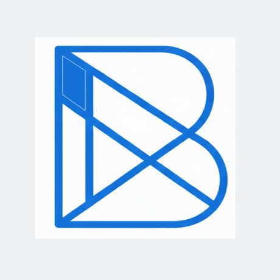
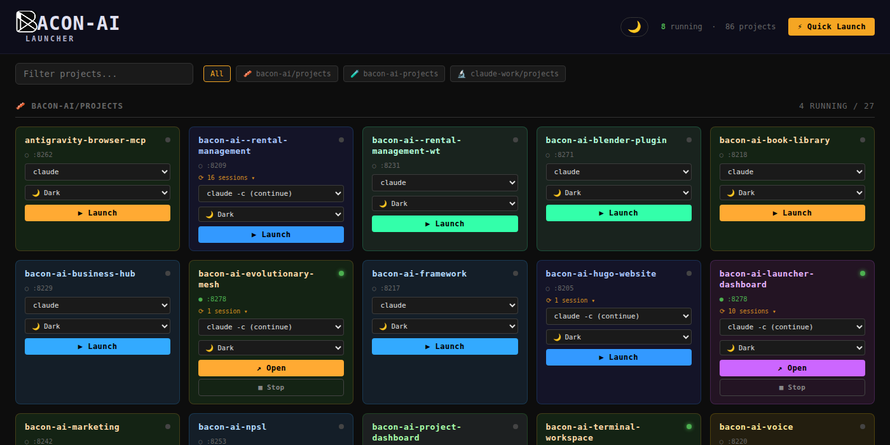
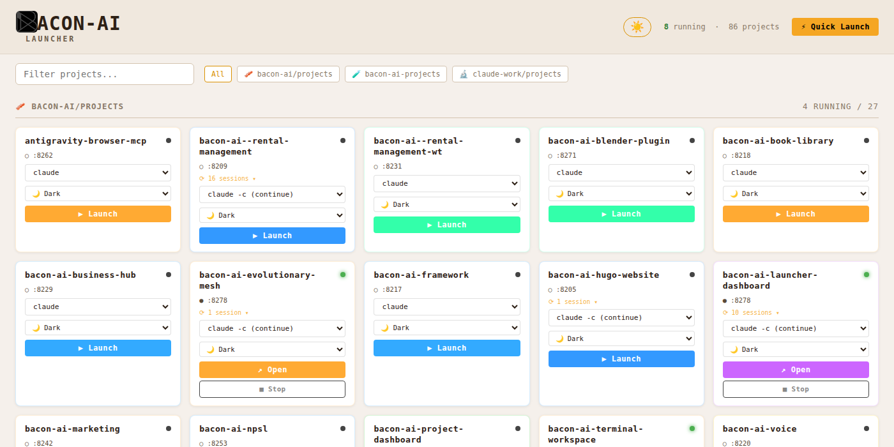
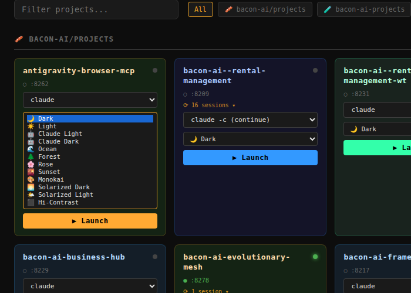
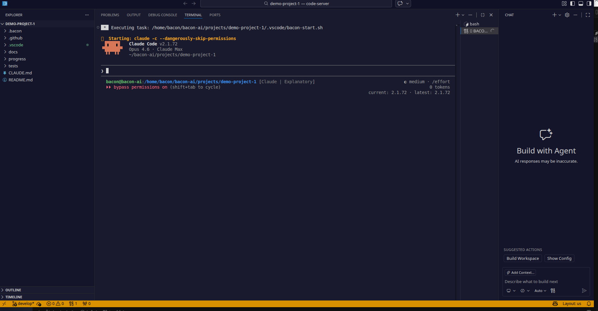
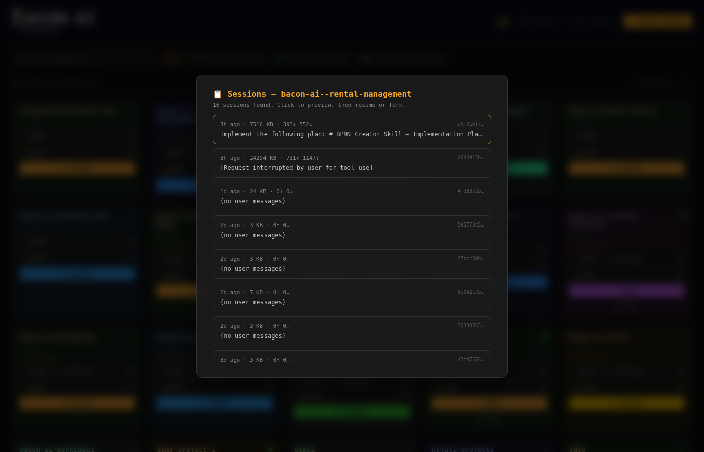
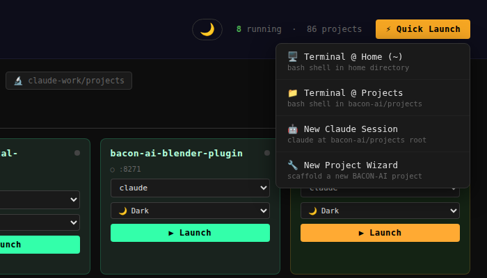

<p align="center">
  
</p>

<h1 align="center">BACON-AI Launcher</h1>

<p align="center">
  <strong>Visual project launcher dashboard for Claude Code CLI &mdash; launch, resume, and color-code your AI coding sessions</strong>
</p>

<p align="center">
  
  
  
  
  
  
</p>

---

> **Note:** This project is in **Alpha**. It is functional and actively used in daily development across 80+ projects, but you may encounter rough edges. Feedback and contributions welcome!

---

## The Problem

You're running 10 Claude Code sessions across different projects. You `Ctrl+Tab` between terminal windows. Which one is the authentication service? Which one is the frontend? They all look identical &mdash; dark terminal, white text, blinking cursor. You open the wrong one, type a command into the wrong project, and spend 5 minutes figuring out what happened.

**BACON-AI Launcher fixes this.**

## The Solution

A single dashboard that shows all your projects at a glance. One click to launch any project into a full VS Code IDE (via code-server) with Claude Code running in the terminal. Color-code each session with a different theme so you **instantly** know which project you're looking at. Resume previous conversations. Fork sessions. Scaffold new projects.

<p align="center">
  
  <br /><em>Dashboard in dark mode &mdash; 86 projects across 3 groups, 8 running sessions</em>
</p>

<p align="center">
  
  <br /><em>Toggle to light mode with one click &mdash; same data, Claude-inspired warm palette</em>
</p>

---

## Key Features

### 12 Color Themes for Instant Session Identification

When you're running 10+ parallel Claude Code sessions, you need to know **instantly** which project you're in. Assign a different theme to each project:

| Theme | Color | Suggested Use |
|-------|-------|---------------|
| Dark | Standard dark | Default sessions |
| Light | Clean white | Documentation work |
| **Claude Light** | Warm cream/amber | Claude-branded projects |
| **Claude Dark** | Deep indigo/amber | AI/ML development |
| **Ocean** | Blue-tinted | Infrastructure & DevOps |
| **Forest** | Green-tinted | Testing & QA |
| **Rose** | Pink-tinted | Frontend & design |
| **Sunset** | Peach/orange | Deployment & ops |
| Monokai | Classic Monokai | Legacy codebases |
| Solarized Dark | Warm dark | Long reading sessions |
| Solarized Light | Warm light | Documentation review |
| Hi-Contrast | Maximum contrast | Accessibility |

<p align="center">
  
  <br /><em>Theme selector dropdown on each project card &mdash; 12 distinct visual identities</em>
</p>

Each theme is applied by **restarting code-server** with the new `settings.json` &mdash; the full IDE environment updates: editor background, sidebar, terminal, status bar, tab colors, and accent highlights.

<p align="center">
  
  <br /><em>A project launched with the Claude Dark theme &mdash; deep indigo background, amber accents, Claude Code running in the terminal</em>
</p>

### Session Browser with Resume & Fork

Browse previous Claude Code conversations per project. Preview the first user messages to remember what each session was about. Then **resume** exactly where you left off, or **fork** to branch a new conversation from any point.

<p align="center">
  
  <br /><em>Session browser showing 16 sessions with message counts, timestamps, and first-line previews</em>
</p>

- Click a session to see a detailed preview (first 10 user messages)
- **Resume** &rarr; `claude --resume <session-id>` &mdash; continues the exact conversation
- **Fork** &rarr; `claude --resume <session-id> --fork-session` &mdash; branches into a new session from that point
- Sessions are detected from `~/.claude/projects/` JSONL files automatically

### Quick Launch Menu

Launch standalone terminals or Claude sessions without navigating to a specific project card:

<p align="center">
  
  <br /><em>Quick Launch dropdown &mdash; terminals, Claude sessions, and the New Project Wizard</em>
</p>

### New Project Wizard

4-step wizard to scaffold a new project with the full BACON-AI directory structure:

1. **Name** &mdash; auto-generates a slug from your project name
2. **Group & Path** &mdash; choose which project group and base directory
3. **Options** &mdash; complexity tier, optional git remote URL
4. **Review & Create** &mdash; scaffolds `docs/`, `progress/`, `tests/`, `README.md`, `CLAUDE.md`, initializes git with `main` + `develop` branches

### Dashboard Light/Dark Mode

Toggle the dashboard itself between dark and light mode with the 🌙/☀️ button in the header. Your preference is saved in `localStorage` and persists across browser sessions.

### Auto-Detect Active Sessions

Projects with existing Claude Code sessions show a session badge (e.g., "⟳ 8 sessions ▾"). The command dropdown auto-selects `claude -c` (continue) for projects that have sessions, so you resume by default.

---

## Architecture

### Single-File Flask App

The entire dashboard is a single Python file (`app.py`) &mdash; no build step, no npm, no React. Flask serves the HTML/CSS/JS inline. This keeps deployment trivial:

```
app.py              ← Everything: routes, API, HTML, CSS, JS
bacon-ai-logo.png   ← Brand logo
```

### How It Works

1. **Project Discovery** &mdash; Scans configured directories for project folders
2. **Port Assignment** &mdash; Each project gets a deterministic port: `8200 + md5(project_name)[:2] % 100`
3. **code-server Launch** &mdash; Starts a code-server instance per project with custom settings
4. **Theme Application** &mdash; Writes `settings.json` with the selected theme's color overrides, kills and restarts code-server
5. **Auto-Command** &mdash; Injects a `tasks.json` that auto-runs your selected Claude command when the IDE opens
6. **Session Detection** &mdash; Reads `~/.claude/projects/<encoded-path>/*.jsonl` files for conversation history

### Port Formula

```
port = 8200 + int(md5(project_name).hexdigest()[:2], 16) % 100
```

- **Never** includes the group key &mdash; changing groups would change the port, which resets browser `localStorage` (sidebar state, extensions)
- Standalone terminal uses fixed port `8199`

### systemd Service

Runs as a user-level systemd service on port 9000 with `KillMode=process` &mdash; restarting the dashboard does **not** kill running code-server instances.

---

## Quick Start

### Prerequisites

- Python 3.10+
- [code-server](https://github.com/coder/code-server) installed and in `$PATH`
- Claude Code CLI (`claude`) installed

### Installation

```bash
# Clone the repo
git clone https://github.com/BACON-AI-CLOUD/bacon-ai-launcher.git
cd bacon-ai-launcher

# Install Flask
pip install flask

# Run
python3 app.py
```

Open `http://localhost:9000` in your browser.

### Configuration

Edit the `PROJECT_SOURCES` list in `app.py` to point to your project directories:

```python
PROJECT_SOURCES = [
    {"key": "projects",  "label": "My Projects",  "path": Path.home() / "projects"},
    {"key": "work",      "label": "Work",          "path": Path.home() / "work"},
]
```

### systemd Service (optional)

```bash
# Copy service file
mkdir -p ~/.config/systemd/user/
cp bacon-launcher.service ~/.config/systemd/user/

# Edit ExecStart path to match your installation
# Then enable and start
systemctl --user enable bacon-launcher
systemctl --user start bacon-launcher
```

---

## Process Flows (BPMN)

Detailed process flows for each feature are documented in [`docs/bpmn/`](docs/bpmn/):

- [Project Launch Flow](docs/bpmn/project-launch-flow.md) &mdash; End-to-end launch sequence
- [Session Management Flow](docs/bpmn/session-management-flow.md) &mdash; Resume & fork workflow
- [New Project Wizard Flow](docs/bpmn/new-project-wizard-flow.md) &mdash; 4-step scaffolding process
- [Multi-Session Workflow](docs/bpmn/multi-session-workflow.md) &mdash; Running 10+ parallel sessions
- [Theme Management Flow](docs/bpmn/theme-management-flow.md) &mdash; Theme application lifecycle

---

## Why This Exists

Claude Code CLI is powerful, but when you're managing many projects simultaneously:

- **Terminal sessions are indistinguishable** &mdash; 10 dark terminals all look the same
- **Session resume is manual** &mdash; you have to remember session IDs or use `/resume` and scroll
- **No visual overview** &mdash; you can't see at a glance which projects are running
- **code-server settings are per-instance** &mdash; themes need to be applied before launch, not after

BACON-AI Launcher solves all of these by wrapping Claude Code + code-server in a visual management layer that gives you IDE-quality development **with** AI-powered CLI sessions **with** instant visual identification.

---

## Contributing

Contributions welcome! Please open an issue first to discuss what you'd like to change.

## License

MIT License &mdash; see [LICENSE](LICENSE) for details.

---

<p align="center">
  <sub>Built with the <a href="https://bacon-ai.cloud">BACON-AI Framework</a></sub>
</p>
