# BPMN: Running 10+ Parallel Sessions

This diagram describes how a developer uses the dashboard to manage multiple concurrent Claude Code sessions across different projects, using visual themes for instant identification and the deterministic port assignment system that enables stable parallel operation.

```mermaid
flowchart TD
    Start([Developer has 10+ active projects]) --> OpenDash[Open Dashboard at :9000]
    OpenDash --> LoadProjects[GET /api/projects\nscans all 3 group directories]

    LoadProjects --> ScanGroups[For each group:\nbacon-ai, staging, claude-work]
    ScanGroups --> ScanDirs[For each project directory:\n- Calculate port: 8200 + md5 mod 100\n- Check socket: is_running on port\n- Check sessions: scan JSONL files\n- Assign card colors from hash]
    ScanDirs --> RenderDashboard[Render project cards\nwith running/stopped status badges]

    RenderDashboard --> PlanThemes[Developer plans theme assignments\nby project category]

    %% Theme assignment strategy
    PlanThemes --> ThemeInfra[Infrastructure projects\nOcean theme - blue tones]
    PlanThemes --> ThemeTesting[Testing projects\nForest theme - green tones]
    PlanThemes --> ThemeFrontend[Frontend projects\nRose theme - pink tones]
    PlanThemes --> ThemeDevOps[DevOps projects\nSunset theme - orange tones]
    PlanThemes --> ThemeAI[AI/ML projects\nClaude theme - warm cream]

    ThemeInfra --> LaunchLoop
    ThemeTesting --> LaunchLoop
    ThemeFrontend --> LaunchLoop
    ThemeDevOps --> LaunchLoop
    ThemeAI --> LaunchLoop

    %% Launch each project
    LaunchLoop[For each project to launch] --> SelectProject[Select project card]
    SelectProject --> PickTheme[Select category-appropriate theme]
    PickTheme --> PickCommand[Select command\nclaude / claude -c / bash]
    PickCommand --> Launch[Click Launch]
    Launch --> PortCalc[Port assigned deterministically\n8200 + md5 project_name mod 100]

    PortCalc --> PortConflict{Port collision\nwith another project?}
    PortConflict -- Yes --> Note1[/Different projects can hash\nto same port. Only one\ncan run at a time on\nthat port./]
    PortConflict -- No --> KillExisting{code-server\nalready on port?}
    KillExisting -- Yes --> Kill[fuser -k port/tcp\nreplace with new config]
    KillExisting -- No --> StartFresh
    Kill --> StartFresh[Start code-server\non assigned port]

    StartFresh --> ServerRunning[code-server running\nwith selected theme applied]
    ServerRunning --> MoreProjects{More projects\nto launch?}
    MoreProjects -- Yes --> LaunchLoop
    MoreProjects -- No --> AllRunning[All sessions running\non ports 8200-8299]

    %% Active work phase
    AllRunning --> BrowserTabs[Each project open in\nseparate browser tab]
    BrowserTabs --> VisualID[Theme colors provide\ninstant identification:\nblue = infra\ngreen = testing\npink = frontend\norange = devops\ncream = AI]

    VisualID --> WorkSession[Developer works across sessions\nswitching tabs by color recognition]

    %% Monitoring
    WorkSession --> RefreshDash[Periodically refresh dashboard\nto check status]
    RefreshDash --> StatusCheck[Dashboard shows per-project:\n- Running indicator green dot\n- Stopped indicator grey dot\n- Session count badges]

    StatusCheck --> Relaunch{Need to restart\na stopped session?}
    Relaunch -- Yes --> SelectProject
    Relaunch -- No --> Continue([Continue multi-session work])

    %% Persistence
    WorkSession --> Persistence[Sessions persist across\ndashboard restarts:\n- Port assignments are deterministic\n- code-server processes independent\n- Browser tabs reconnect automatically]

    style Start fill:#1565c0,color:#fff
    style Continue fill:#2e7d32,color:#fff
    style Note1 fill:#f57f17,color:#000
```

## Key Decisions

| Decision | Rationale |
|----------|-----------|
| **Deterministic port assignment** (ADR-002) | Port = 8200 + md5(project_name)[:2] % 100. Every project always gets the same port, so browser tabs, bookmarks, and localStorage persist across restarts. The range 8200-8299 supports up to 100 unique ports. |
| **Theme-based visual identification** | With 10+ browser tabs open, reading tab titles is slow. Color-coded themes (Ocean=blue, Forest=green, Rose=pink, Sunset=orange) provide instant visual recognition of which project category a tab belongs to. |
| **Independent code-server processes** | Each project runs as a separate code-server process. No shared state, no central process manager. If one crashes, others continue. The dashboard simply checks socket connectivity to report status. |
| **Port collision is a known constraint** | With md5 mod 100, different project names can hash to the same port. This is accepted as rare (1% chance per pair). When it happens, only one project can run at a time on that port. The dashboard's kill-before-start behavior handles this gracefully. |
| **No persistent theme storage per project** | Themes are selected at launch time, not stored. This keeps the architecture stateless (no database). A planned enhancement (F-006, .bacon/launcher.conf) would persist per-project preferences. |
| **Browser tab reconnection** | code-server supports automatic reconnection. If the dashboard restarts but code-server processes remain running, browser tabs reconnect without user action. |
