# BPMN: New Project Scaffolding

This diagram describes the 4-step New Project Wizard that scaffolds a complete BACON-AI project with the canonical directory structure, documentation templates, git initialization, and optional remote configuration. The wizard is implemented as an inline modal in the single-file Flask app (ADR-005).

```mermaid
flowchart TD
    Start([User clicks Quick Launch menu]) --> SelectWizard[Select 'New Project Wizard']
    SelectWizard --> OpenWizard[4-step wizard modal opens]

    %% Step 1
    OpenWizard --> Step1[Step 1: Project Identity]
    Step1 --> EnterName[User enters project name\ne.g. 'My Cool Service']
    EnterName --> AutoSlug[Auto-generate slug\n'my-cool-service']
    AutoSlug --> UserEditsSlug{User edits slug?}
    UserEditsSlug -- Yes --> CustomSlug[User provides custom slug]
    UserEditsSlug -- No --> KeepSlug[Keep auto-generated slug]
    CustomSlug --> ValidateSlug
    KeepSlug --> ValidateSlug
    ValidateSlug{Slug valid?\nlowercase, hyphens only} -- No --> EnterName
    ValidateSlug -- Yes --> NextStep1[Click Next]

    %% Step 2
    NextStep1 --> Step2[Step 2: Group & Path]
    Step2 --> SelectGroup[Select project group\nbacon-ai / staging / claude-work]
    SelectGroup --> AutoPath[Auto-compute path\ngroup_base_path / slug]
    AutoPath --> UserOverride{User overrides path?}
    UserOverride -- Yes --> CustomPath[User enters custom path]
    UserOverride -- No --> KeepPath[Keep computed path]
    CustomPath --> NextStep2[Click Next]
    KeepPath --> NextStep2

    %% Step 3
    NextStep2 --> Step3[Step 3: Configuration]
    Step3 --> SelectTier[Select complexity tier\nSTANDARD / MODERATE / COMPLEX / ENTERPRISE]
    SelectTier --> GitRemote{Add git remote?}
    GitRemote -- Yes --> EnterRemote[Enter git remote URL]
    GitRemote -- No --> SkipRemote[No remote configured]
    EnterRemote --> NextStep3[Click Next]
    SkipRemote --> NextStep3

    %% Step 4
    NextStep3 --> Step4[Step 4: Review & Confirm]
    Step4 --> ReviewSummary[Display summary:\n- Name & slug\n- Group & path\n- Complexity tier\n- Git remote if set]
    ReviewSummary --> UserConfirms{User clicks Create?}
    UserConfirms -- No / Back --> Step1
    UserConfirms -- Yes --> CallAPI[POST /api/scaffold\nname, slug, group, path,\ncomplexity_tier, git_remote]

    %% API Processing
    CallAPI --> ValidateInput{Name and slug\nprovided?}
    ValidateInput -- No --> Err400([400: Name and slug required])
    ValidateInput -- Yes --> ResolvePath[Resolve project path\nfrom group or custom path]
    ResolvePath --> CheckExists{Directory\nalready exists?}
    CheckExists -- Yes --> Err409([409: Directory already exists])
    CheckExists -- No --> CreateDirs[Create directory structure]

    CreateDirs --> MakeDocs[docs/prd, docs/urd, docs/adr,\ndocs/tsd, docs/fsd]
    CreateDirs --> MakeProgress[progress/planned,\nprogress/in-progress,\nprogress/testing,\nprogress/completed,\nprogress/lessons-learned,\nprogress/ssc-reviews,\nprogress/testing/evidence/cp7-9+rgt]
    CreateDirs --> MakeTests[tests/unit,\ntests/integration,\ntests/e2e]
    CreateDirs --> MakeGithub[.github/]

    MakeDocs --> WriteFiles
    MakeProgress --> WriteFiles
    MakeTests --> WriteFiles
    MakeGithub --> WriteFiles

    WriteFiles[Write template files] --> WriteREADME[README.md\nproject name + structure overview]
    WriteFiles --> WriteCLAUDE[CLAUDE.md\nOrchestrator v3.1 template\nwith project identity table]

    WriteREADME --> CopyBacon{~/.bacon\nframework exists?}
    WriteCLAUDE --> CopyBacon
    CopyBacon -- Yes --> CopyFramework[Copy .bacon/ directory\ninto project]
    CopyBacon -- No --> SkipFramework[Skip framework copy]
    CopyFramework --> GitInit
    SkipFramework --> GitInit

    GitInit[git init + initial commit\ncreate main + develop branches] --> HasRemote{Git remote\nprovided?}
    HasRemote -- Yes --> AddRemote[git remote add origin URL]
    HasRemote -- No --> SkipAddRemote[No remote added]
    AddRemote --> ReturnSuccess
    SkipAddRemote --> ReturnSuccess

    ReturnSuccess[Return JSON:\npath, slug, group] --> RefreshDashboard[Dashboard refreshes\nproject list]
    RefreshDashboard --> ProjectVisible([New project appears\nin selected group])

    style Start fill:#1565c0,color:#fff
    style ProjectVisible fill:#2e7d32,color:#fff
    style Err400 fill:#c62828,color:#fff
    style Err409 fill:#c62828,color:#fff
```

## Key Decisions

| Decision | Rationale |
|----------|-----------|
| **Inline wizard modal** (ADR-005) | Keeps the single-file architecture. No separate pages, no React, no database needed. The 4-step wizard is implemented entirely in inline JavaScript within the Flask template. |
| **Auto-slug from project name** (L-006) | Automatically converts "My Cool Service" to "my-cool-service". Users can override but rarely need to. Reduces friction in the most common path. |
| **Canonical BACON-AI directory structure** | Every project gets the same docs/, progress/, tests/ layout. This ensures consistency across all BACON-AI projects and satisfies the NPSL governance framework's structural requirements. |
| **CLAUDE.md generated with Orchestrator template** | Pre-populates the project identity table, complexity tier, and framework references. New projects are immediately ready for Claude Code sessions without manual setup. |
| **Complexity tier selection** | STANDARD / MODERATE / COMPLEX / ENTERPRISE maps to the BACON-AI framework's control point activation levels. Written into CLAUDE.md so the orchestrator knows which gates apply. |
| **Git init with main + develop branches** | Follows the project's git strategy convention. Both branches are created from the initial commit so development can begin immediately on the develop branch. |
| **Directory existence check returns 409** | Prevents accidental overwriting of existing projects. The user must choose a unique slug or path. |
