# BPMN: Launching a Claude Code Project

This diagram describes the end-to-end flow when a user launches a Claude Code session from the BACON-AI Launcher Dashboard. The process covers project selection, theme and command configuration, code-server lifecycle management, and automatic CLI startup via VS Code tasks.json.

```mermaid
flowchart TD
    Start([User opens Dashboard :9000]) --> Browse[Browse project groups\nbacon-ai / staging / claude-work]
    Browse --> SelectProject[Select project card]
    SelectProject --> CheckSessions{Project has\nClaude sessions?}

    CheckSessions -- Yes --> AutoContinue[Default command set to\n'claude -c' auto-resume]
    CheckSessions -- No --> DefaultCmd[Default command set to\n'claude']
    AutoContinue --> SelectCommand
    DefaultCmd --> SelectCommand

    SelectCommand[Select command from dropdown\nclaude / claude -c / bash / custom] --> SelectTheme[Select theme from dropdown\nDark / Light / Claude / Ocean / Forest / Rose / Sunset / HC]
    SelectTheme --> ClickLaunch[Click Launch button]

    ClickLaunch --> API[POST /api/launch/group/project\nwith command + theme key]
    API --> ValidateGroup{Group exists in\nPROJECT_SOURCES?}
    ValidateGroup -- No --> Err404_1([404: Unknown group])
    ValidateGroup -- Yes --> ValidateProject{Project directory\nexists on disk?}
    ValidateProject -- No --> Err404_2([404: Project not found])
    ValidateProject -- Yes --> CalcPort[Calculate port\n8200 + md5 project_name mod 100]

    CalcPort --> CreateDirs[Create per-project\nuser-data-dir under\n~/.local/share/code-server/instances/]
    CreateDirs --> WriteSettings[Write User/settings.json\n- colorTheme from preset\n- colorCustomizations\n- trust suppression\n- panel maximized\n- task.allowAutomaticTasks: on]

    WriteSettings --> WriteStartScript[Write .vscode/bacon-start.sh\nwith baked-in command]
    WriteStartScript --> WriteTasks[Write .vscode/tasks.json\nrunOn: folderOpen\nruns bacon-start.sh]

    WriteTasks --> CheckRunning{code-server already\nrunning on port?}
    CheckRunning -- Yes --> Kill[fuser -k port/tcp\nwait 1s]
    CheckRunning -- No --> ClearStorage
    Kill --> ClearStorage[Clear workspaceStorage\nto reset layout state]

    ClearStorage --> StartCS[Start code-server\n--bind-addr 0.0.0.0:port\n--auth none\n--user-data-dir per-project\nopen project_dir]

    StartCS --> WaitLoop{Port responds?\nup to 5s polling}
    WaitLoop -- Not yet --> WaitLoop
    WaitLoop -- Yes --> ReturnURL[Return JSON:\nurl, tailscale_url, port]
    WaitLoop -- Timeout --> Err500([500: Failed to start])

    ReturnURL --> BrowserOpen[Browser opens code-server\nat http://host:port]
    BrowserOpen --> TasksRun[tasks.json triggers\nbacon-start.sh on folderOpen]
    TasksRun --> CLIStarts[Terminal opens with\nselected Claude CLI command]
    CLIStarts --> Working([User works in IDE\nwith Claude in terminal])

    style Start fill:#2e7d32,color:#fff
    style Working fill:#2e7d32,color:#fff
    style Err404_1 fill:#c62828,color:#fff
    style Err404_2 fill:#c62828,color:#fff
    style Err500 fill:#c62828,color:#fff
```

## Key Decisions

| Decision | Rationale |
|----------|-----------|
| **Port = md5(project_name) only** (ADR-002) | Group key excluded from hash so the port never changes if a project moves between groups. Changing port means a new browser origin, which wipes VS Code sidebar/localStorage state. |
| **Kill-then-restart on every launch** | code-server caches settings in memory. Writing settings.json alone does not update a running instance, so a full restart is required to apply theme or command changes. |
| **tasks.json with runOn: folderOpen** (ADR-003) | More reliable than bashrc hooks. The VS Code task runner fires deterministically when the workspace folder opens, regardless of shell configuration. |
| **Baked command in bacon-start.sh** | The selected command (claude, claude -c, bash) is written directly into the shell script. This avoids env-var indirection and ensures the correct command runs even if the temp file is cleaned up. |
| **workspaceStorage cleared on launch** | Sidebar visibility and panel state are stored in workspaceStorage, not settings.json. Clearing it ensures the layout always matches the configured settings (panel maximized, sidebar hidden). |
| **Per-project user-data-dir** | Each project gets its own code-server instance directory so workspace state, recently opened files, and extensions are isolated between projects. |
