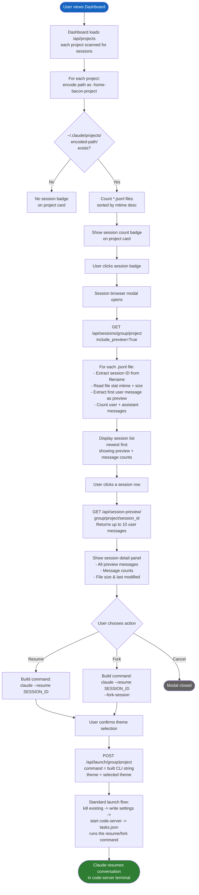

# BPMN: Session Resume & Fork Flow

This diagram describes how a user discovers, browses, and resumes (or forks) existing Claude Code sessions from the dashboard. The system reads Claude's JSONL session files from disk, presents previews and metadata, and builds the appropriate CLI command for resuming or forking a conversation.

## Key Decisions

| Decision | Rationale |
|----------|-----------|
| **Session detection via JSONL files** (ADR-004) | Claude Code stores sessions as JSONL files in ~/.claude/projects/encoded-path/. Reading these directly avoids any dependency on Claude's internal APIs. |
| **Path encoding: / becomes -** (L-004) | Claude encodes project paths by replacing slashes with dashes (e.g., /home/bacon/foo becomes -home-bacon-foo). The dashboard must match this encoding exactly. |
| **Preview extraction limited to user messages** | Only messages with type="user" are shown in previews. Assistant messages are counted but not displayed, keeping the preview concise and meaningful. |
| **Two-tier fetch: list then detail** | The session list endpoint returns minimal data (1 preview per session). The detail endpoint returns up to 10 messages. This keeps the initial modal load fast when projects have many sessions. |
| **Resume vs Fork uses same launch flow** | Both operations build a CLI command string that gets baked into bacon-start.sh. The only difference is whether --fork-session is appended. This reuses the entire launch infrastructure. |
| **Sessions sorted newest-first by mtime** | The most recently active session is most likely what the user wants to resume, so it appears at the top of the list. |
