# BPMN: Theme Application & Code-Server Lifecycle

This diagram describes the complete lifecycle of applying a theme to a code-server instance, including the settings generation, process management, and workspace storage handling required for themes to take effect reliably.

```mermaid
flowchart TD
    Start([User selects theme\nfrom dropdown]) --> ThemeList[Available themes:\nDark, Light, Claude, Ocean,\nForest, Rose, Sunset, High Contrast]
    ThemeList --> ClickLaunch[User clicks Launch]

    ClickLaunch --> APIReceives[API receives theme key\ne.g. 'ocean']
    APIReceives --> LookupTheme[Look up theme in THEMES dict]
    LookupTheme --> ThemeConfig[Theme config contains:\n- label: display name\n- colorTheme: base VS Code theme\n- colorCustomizations: full UI overrides]

    ThemeConfig --> BuildSettings[Build settings.json object]

    %% Settings composition
    BuildSettings --> BaseSettings[Base settings:\n- window.title\n- task.allowAutomaticTasks: on\n- terminal.integrated.cwd\n- workbench.startupEditor: none\n- security.workspace.trust: disabled]

    BaseSettings --> ThemeSettings[Theme settings:\n- workbench.colorTheme = base theme\n  e.g. 'Default Light Modern'\n- workbench.colorCustomizations =\n  editor.background,\n  sideBar.background,\n  activityBar.background + foreground,\n  titleBar.activeBackground,\n  panel.background + border,\n  terminal.background + foreground,\n  statusBar.background + foreground,\n  tab.activeBackground + inactiveBackground,\n  tab.activeBorderTop + border,\n  focusBorder, textLink.foreground,\n  button.background + foreground,\n  progressBar.background]

    ThemeSettings --> LayoutSettings[Layout settings:\n- activityBar.visible: false\n- auxiliaryBar.visible: false\n- statusBar.visible: true\n- panel.defaultLocation: bottom\n- panel.opensMaximized: always]

    LayoutSettings --> WriteJSON[Write combined settings to\nuser-data-dir/User/settings.json]

    %% Process lifecycle
    WriteJSON --> CheckProcess{code-server\nrunning on port?}
    CheckProcess -- Yes --> WhyKill[/Settings cached in memory.\nWriting to disk alone does\nNOT update running instance./]
    WhyKill --> KillProcess[fuser -k port/tcp\nSend SIGKILL to process]
    KillProcess --> WaitDeath[sleep 1s\nensure port is released]
    WaitDeath --> ClearStorage
    CheckProcess -- No --> ClearStorage

    ClearStorage --> WhyClear[/Sidebar visibility and panel\nstate stored in workspaceStorage,\nnot in settings.json./]
    WhyClear --> RmStorage[shutil.rmtree\nuser-data-dir/workspaceStorage/]

    RmStorage --> StartProcess[Start fresh code-server\ncode-server\n  --bind-addr 0.0.0.0:port\n  --auth none\n  --disable-telemetry\n  --user-data-dir per-project-dir\n  project-folder]

    StartProcess --> ProcessInit[code-server reads\nUser/settings.json on startup]
    ProcessInit --> ApplyBase[Apply base colorTheme\ne.g. Default Light Modern]
    ApplyBase --> ApplyCustom[Apply colorCustomizations\noverride individual UI elements]
    ApplyCustom --> ApplyLayout[Apply layout settings\npanel maximized, sidebar hidden]

    %% Readiness check
    ApplyLayout --> PollReady{Port accepting\nconnections?\nPoll every 0.5s\nmax 10 attempts}
    PollReady -- Not yet --> PollReady
    PollReady -- Ready --> ReturnURL[Return URLs to frontend\nhttp://host:port]
    PollReady -- Timeout 5s --> Err500([500: Failed to start])

    ReturnURL --> BrowserLoads[Browser opens or refreshes\ncode-server URL]
    BrowserLoads --> ThemeVisible[Theme fully applied:\n- Editor background color\n- Sidebar color\n- Activity bar accent\n- Terminal colors\n- Status bar color\n- Tab styling]

    ThemeVisible --> UserSees([User sees themed IDE\nwith instant visual identity])

    %% Persistence note
    UserSees --> PersistNote[/Theme persists until\nnext launch with\ndifferent theme selected.\nNo database needed -\nsettings.json on disk./]

    style Start fill:#1565c0,color:#fff
    style UserSees fill:#2e7d32,color:#fff
    style Err500 fill:#c62828,color:#fff
    style WhyKill fill:#f5f5f5,color:#333
    style WhyClear fill:#f5f5f5,color:#333
    style PersistNote fill:#f5f5f5,color:#333
```

## Key Decisions

| Decision | Rationale |
|----------|-----------|
| **Two-layer theme system: base + customizations** | Each theme sets a `colorTheme` (e.g., "Default Light Modern") as the foundation, then overrides specific UI elements via `colorCustomizations`. This provides complete control while building on VS Code's built-in themes for syntax highlighting. |
| **Full process restart required for theme changes** | code-server loads settings.json into memory at startup and caches them. Simply writing a new settings.json to disk does not update the running instance. A kill-and-restart cycle is the only reliable way to apply theme changes. |
| **workspaceStorage must be cleared** | VS Code persists layout state (sidebar visibility, panel position, editor group layout) in the workspaceStorage directory, separate from settings.json. Without clearing it, previous layout state overrides the new settings on restart. |
| **fuser -k for process termination** | Uses `fuser -k port/tcp` rather than tracking PIDs. This is more robust because it kills whatever process holds the port, even if the PID tracking gets out of sync (e.g., after a dashboard restart). |
| **0.5s polling with 5s timeout** | code-server typically starts in 1-2 seconds. Polling every 500ms with a 10-attempt (5s) limit balances responsiveness with reliability. The 500ms interval avoids hammering the socket. |
| **17 customizable UI elements per theme** | Each theme can override editor, sidebar, activity bar, title bar, panel, terminal, status bar, tabs, focus border, text links, buttons, and progress bar. This covers every major visual surface in the IDE. |
| **Stateless theme selection** | Theme choice is not persisted per project (no database). The user selects a theme each time they launch. This aligns with the single-file, no-database architecture (ADR-001). Future enhancement F-006 (.bacon/launcher.conf) would add persistence. |
